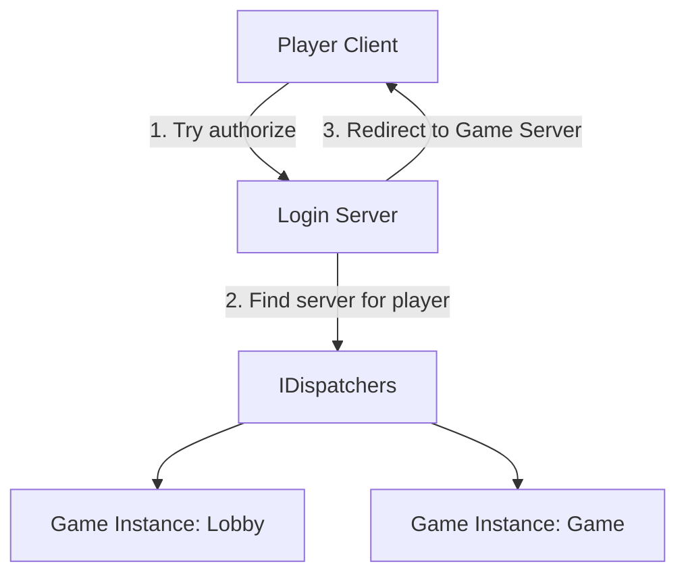

# Opaq.Net1

A modular, distributed game server architecture built with **C#**. This project is a personal sandbox for exploring high-scale networking and distributed system design.

> [!IMPORTANT]
> **Status: WIP/PoC.** This is a hobby project written in my spare time. It is far from a finished product.

### Components

---
*Developed for learning and fun.*